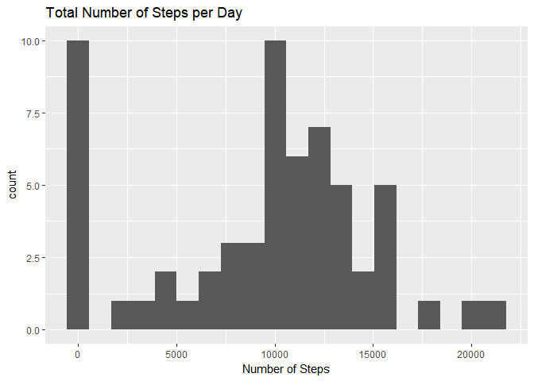
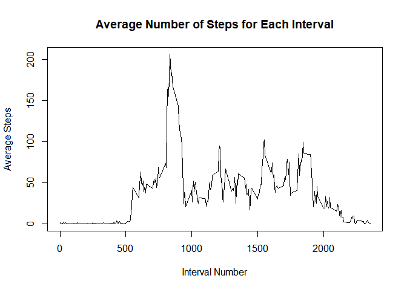
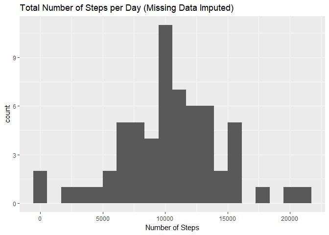
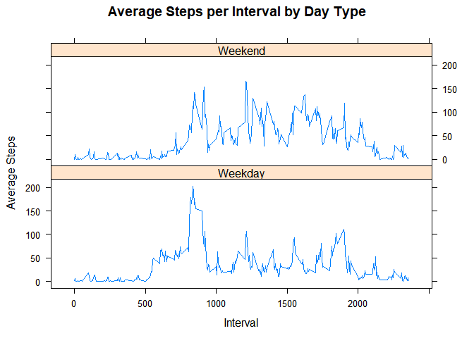

# Reproducible Research: Peer Assessment 1


## Loading and preprocessing the data
The following code will load the data from 'activity.csv'. The CSV file must
first be extracted from the .ZIP file. 


```r
unzip("activity.zip")
activity <- read.csv('activity.csv')
```


## What is mean total number of steps taken per day?
What is the total number of steps taken per day? Use _tapply_ to determine the
total number of steps per day.


```r
totStepsPerDay <- tapply(activity$steps, activity$date, sum, na.rm=T)
```

Make a histogram of the total steps per day using _qplot_ in the _ggplot2_ 
library.


```r
library(ggplot2)
qplot(totStepsPerDay, bins=20, xlab = 'Number of Steps', main = "Total Number of Steps per Day")
```

<!-- -->


```r
meanTotalSteps <- mean(totStepsPerDay)
medianTotalSteps <- median(totStepsPerDay)
```

The mean total steps per day is: 9354.23 and the median total steps
per day is: 10395.


## What is the average daily activity pattern?
First we will make a time series plot of the average number of steps taken versus
the 5-minute intervals. To do this, we will use the *group_by* function in the
*dplyr* package. 


```r
library(dplyr)
```

First, let's create a new data frame that contains the average number of steps 
taken across all days in each interval.


```r
avgIntSteps <- group_by(activity, interval) %>% summarize(avgStep=mean(steps, na.rm=T))
```

Now, we can plot the resulting data in a time series plot using the _type='l'_ 
argument in the plot function.

```r
plot(avgIntSteps$interval, avgIntSteps$avgStep, type='l',
     xlab = 'Interval Number', ylab='Average Steps', 
     main = 'Average Number of Steps for Each Interval')
```

<!-- -->

Which 5-minute interval, on average across all the days in the dataset, contains
the maximum number os steps?

```r
avgIntSteps$interval[which.max(avgIntSteps$avgStep)]
```

```
## [1] 835
```


## Imputing missing values

```r
stepMissing <- sum(is.na(activity$steps))
percentMissing <- mean(is.na(activity$steps))*100
```

The total number of missing values (for the step variable) in the data set is:
2304, which is 13.11475% of the data set.

### A strategy for determining the missing values
A robust method for imputing missing values is to use the _mice_ function from
the _mice_ package. This function determines a value for the missing data through
random sampling. Install the _mice_ package and execute _?mice_ for 
additional information. 

_Note: Due to the size of the data set, this function may take some time to complete._


```r
library(mice)
tempData <- mice(activity, m=5, maxit = 50, method = "pmm", seed=500)
completedData <- complete(tempData, 1)
```

The new data set, _completedData_, is the same size as the original data set, 
_activity_.

Calculate the total steps per day using the completed data set.

```r
totStepsPerDayComp <- tapply(completedData$steps, completedData$date, sum)
meanCompleteSteps <- mean(totStepsPerDayComp)
medianCompleteSteps <- median(totStepsPerDayComp)
```

The mean steps per day for the completed data set is: 10399.89. 
Compare this to the mean steps per day for the data set that includes missing
data: 9354.23. The median steps per day for the completed data set is:
10439. Compare this to the median steps per day for the data
set that includes missing data: 10395. As you can see, using the 
_mice_ function has a negligible effect on both the mean and the median when
imputing missing data. 

Here is a histogram of the total steps per day with the NA values removed:


```r
qplot(totStepsPerDayComp, bins=20, xlab = 'Number of Steps', 
      main = "Total Number of Steps per Day (Missing Data Imputed)")
```

<!-- -->


## Are there differences in activity patterns between weekdays and weekends?
Is there a difference in activity patterns between the weekdays and the 
weekends? To figure this out, we first have to convert the _date_ factor to a 
_Date_ type. Then we can create a new variable to classify the type of day.


```r
completedData$date <- as.Date(completedData$date)
dow <- weekdays(completedData$date)
completedData$dayType <- ifelse((dow=="Saturday"|dow=="Sunday"), 
                                "Weekend","Weekday")
```

We need to calculate the average steps per interval by day type. We can do this
with the *group_by* function of the _dplyr_ package. 


```r
library(dplyr)
avgStepDay <- group_by(completedData, interval, dayType) %>% 
    summarize(steps = mean(steps))
```

Now we can create a panel plot comparing the average steps per interval by the 
type of day.


```r
library(lattice)
xyplot(steps~interval|factor(dayType), data = avgStepDay, type="l", layout=c(1,2), ylab = "Average Steps", xlab = "Interval", main = "Average Steps per Interval by Day Type")
```

<!-- -->
